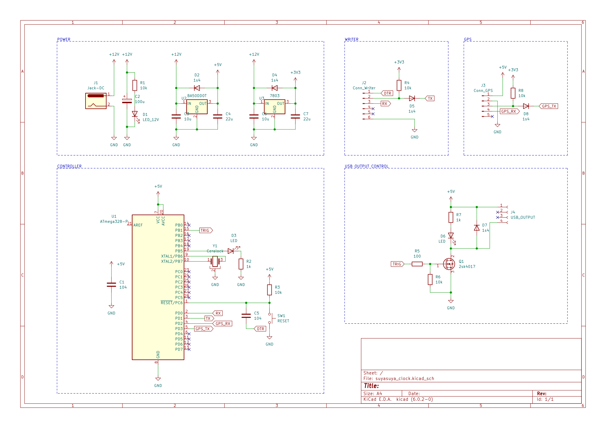
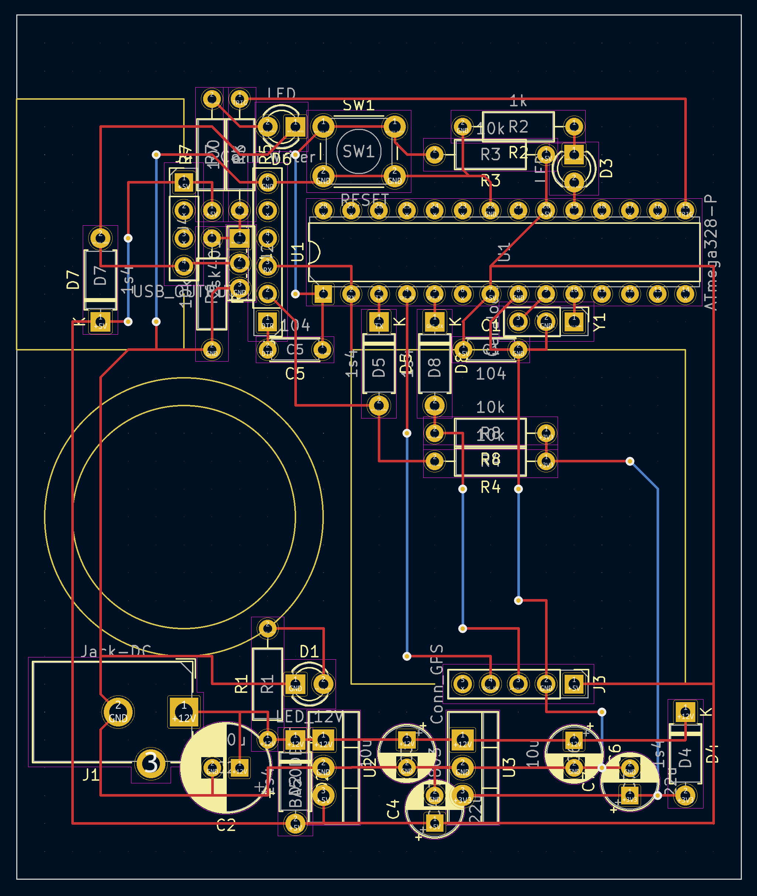
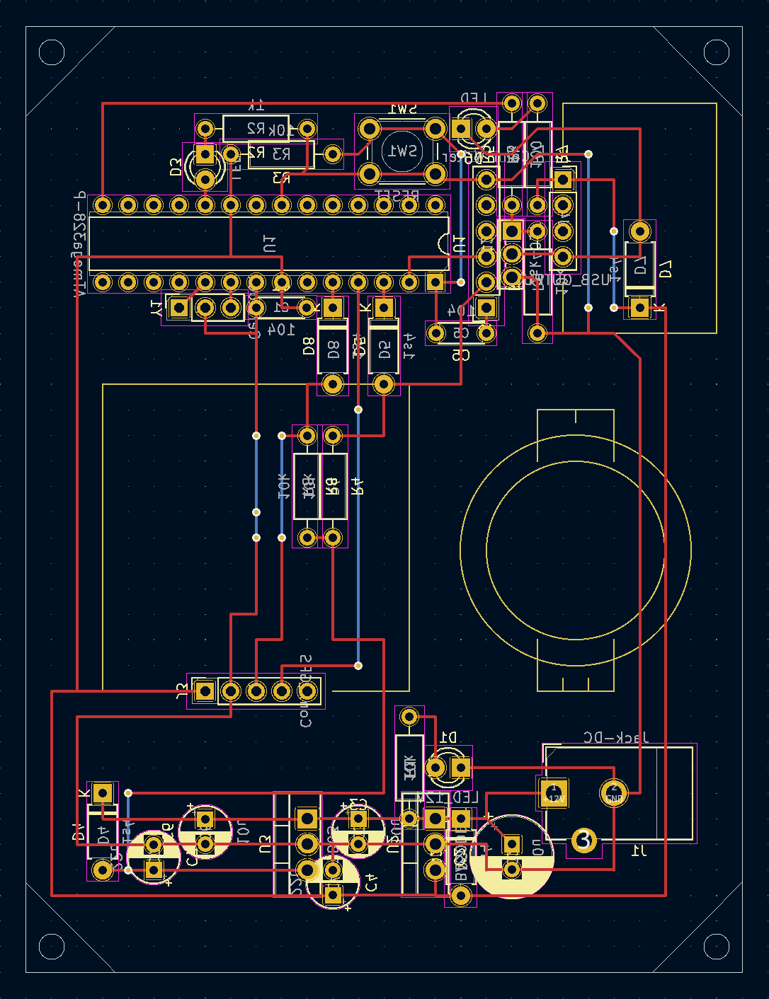

# suyasuya-streaming

スヤスヤ :sleeping:

## CIRCUIT DIAGRAM
[pdf](kicad/suyasuya_clock/suyasuya_clock.pdf)

## Artwork
### top

### bottom

## 購入品リスト

- [usbコネクタdip化基板](https://akizukidenshi.com/catalog/g/gK-07429/)
- [usb出力電圧制御用FET](https://akizukidenshi.com/catalog/g/gI-07597/)
- [5v,0.5A 降圧チョッパ](https://akizukidenshi.com/catalog/g/gM-15209/)
- [3v3,0.5A 降圧チョッパ](https://akizukidenshi.com/catalog/g/gM-15148/)
- [簡易絶縁用フォトカプラ](https://akizukidenshi.com/catalog/g/gI-07554/)
- [時刻取得用gpsモジュール](https://akizukidenshi.com/catalog/g/gK-09991/) (RTC機能あり?)
- [bootloader書き込み済みのATMEGA(3v3, INT8MHz)](https://akizukidenshi.com/catalog/g/gI-12775/)
- [bootloader書き込み済みのATMEGA(5v, EXT16MHz)](https://akizukidenshi.com/catalog/g/gI-12774/)
- [16MHzセラミック発振子](https://akizukidenshi.com/catalog/g/gP-09576/) (負荷容量付き)
- [12vスイッチングACアダプタ](https://akizukidenshi.com/catalog/g/gM-01804/)
- [2.1mm標準DCジャック](https://akizukidenshi.com/catalog/g/gC-09408/)